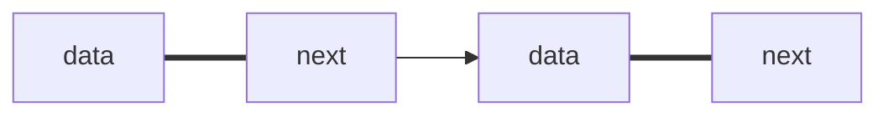

> 顺序表在插入和删除操作需要移动大量元素。数组的大小不好确定，且存储分配需要一整段连续的存储空间，造成很多碎片。因此在需要经常插入和删除的线性表中，需要通过链式存储方式实现。线性表的链式表示称为链表。

<!--more-->

### 一、单链表

逻辑上相邻的两个元素在物理位置上不相邻。



单链表结点的定义：

```c
typedef struct LNode {  //单链表结点类型
  	ElemType data;    //数据域
  	struct LNode *next;  //指针域
} LNode, *LinkList;  // LinkList 等价于 struct LNode *
```

头指针：链表中第一个结点的存储位置，用来标识单链表。

头结点：在单链表第一个结点之前附加的个结点，为了操作上的方便。

若链表有头结点，则头指针永远指向头结点，不论链表是否为空，头指针均不为空，头指针是链表的必须元素，他标识一个链表。

头结点是为了操作的方便而设立的，其数据域一般为空，或者存放链表的长度。有头结点后，对在第一结点前插入和删除第一结点的操作就统一了，不需要频繁重置头指针。但头结点不是必须的。


