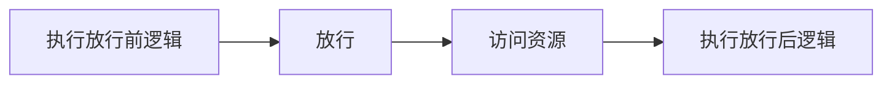

> Java Web 核心第五章。Filter 和 Listener 是 JavaWeb 三大组件（Servlet、Filter、Listener）的另两个组成部分。Filter 表示过滤器，可以把对资源的请求拦截下来，从而实现一些特殊的功能。Listener 监听器可以监听就是在 `application`，`session`，`request` 三个对象创建、销毁或者往其中添加修改删除属性时自动执行代码的功能组件。 `application` 是 `ServletContext` 类型的对象。`ServletContext` 代表整个 web 应用，在服务器启动的时候，tomcat 会自动创建该对象，在服务器关闭时会自动销毁该对象。以下为我在学习和实战练习过程中所做的笔记，可供参考。

<!--more-->

### 一、Filter

过滤器一般完成一些通用的操作。比如每个资源都要写一些代码完成某个功能，此时我们可以将这些代码写在过滤器中，因为请求每一个资源都要经过过滤器。例如：权限控制、统一编码处理、敏感字符处理等。

#### Filter 快速入门

进行 `Filter` 开发分成以下三步实现：

1.   定义类，实现 Filter 接口，并重写其所有方法。

2.   配置 Filter 拦截资源的路径：在类上定义 `@WebFilter` 注解。而注解的 `value` 属性值 `/*` 表示拦截所有的资源。

3.   在 doFilter 方法中输出一句话，并放行。

     ```java
     @WebFilter("/*")
     public class FilterDemo implements Filter {
     
         @Override
         public void doFilter(ServletRequest request, ServletResponse response, FilterChain chain) throws IOException, ServletException {
             System.out.println("1.FilterDemo...");
             //放行
             chain.doFilter(request,response);
         }
     
         @Override
         public void init(FilterConfig filterConfig) throws ServletException {
         }
     
         @Override
         public void destroy() {
         }
     }
     
     
     ```

#### Filter 执行流程




#### Filter 拦截路径配置

拦截路径表示 Filter 会对请求的哪些资源进行拦截，使用 `@WebFilter` 注解进行配置。如：`@WebFilter("拦截路径")` 。拦截路径的配置方式和 `Servlet` 的请求资源路径配置方式一样，但是表示的含义不同。

拦截路径有四种配置方式：

1.  拦截具体的资源：`/index.jsp`：只有访问 `index.jsp` 时才会被拦截。
2.  目录拦截：`/user/*`：访问 `/user` 下的所有资源，都会被拦截。
3.  后缀名拦截：`*.jsp`：访问后缀名为 `jsp` 的资源，都会被拦截。
4.  拦截所有：`/*`：访问所有资源，都会被拦截。

#### 过滤器链

过滤器链是指在一个 Web 应用，可以配置多个过滤器，这多个过滤器称为过滤器链。注解配置 Filter 的优先级是按照过滤器类名（字符串）的自然先后排序。


#### 需求实现

访问服务器资源时，需要先进行登录验证，如果没有登录，则自动跳转到登录页面。只需要写一个 `Filter` ，在该过滤器中进行登陆状态校验即可。而在该 `Filter` 中逻辑如下：


```java
@WebFilter("/*")
public class LoginFilter implements Filter {
    @Override
    public void doFilter(ServletRequest request, ServletResponse response, FilterChain chain) throws ServletException, IOException {
        HttpServletRequest req = (HttpServletRequest) request;
        
        //判断访问资源路径是否和登录注册相关
        //1,在数组中存储登陆和注册相关的资源路径
        String[] urls = {"/login.jsp","/imgs/","/css/","/loginServlet","/register.jsp","/registerServlet","/checkCodeServlet"};
        //2,获取当前访问的资源路径
        String url = req.getRequestURL().toString(); 

        //3,遍历数组，获取到每一个需要放行的资源路径
        for (String u : urls) {
            //4,判断当前访问的资源路径字符串是否包含要放行的的资源路径字符串
            /*
                比如当前访问的资源路径是  /brand-demo/login.jsp
                而字符串 /brand-demo/login.jsp 包含了  字符串 /login.jsp ，所以这个字符串就需要放行
            */
            if(url.contains(u)){
                //找到了，放行
                chain.doFilter(request, response);
                //break;
                return;
            }
        }
   
        //1. 判断session中是否有user
        HttpSession session = req.getSession();
        Object user = session.getAttribute("user");

        //2. 判断user是否为null
        if(user != null){
            // 登录过了
            //放行
            chain.doFilter(request, response);
        }else {
            // 没有登陆，存储提示信息，跳转到登录页面

            req.setAttribute("login_msg","您尚未登陆！");
            req.getRequestDispatcher("/login.jsp").forward(req,response);
        }
    }

    public void init(FilterConfig config) throws ServletException {
    }

    public void destroy() {
    }
}
```

### 二、Listener

#### Listener 分类

JavaWeb 提供了8个监听器：


#### `ServletContextListener` 监听器

`ServletContextListener` 接口中有以下两个方法：

1.  `void contextInitialized(ServletContextEvent sce)`：`ServletContext` 对象被创建了会自动执行的方法。
2.  `void contextDestroyed(ServletContextEvent sce)`：`ServletContext` 对象被销毁时会自动执行的方法。

定义一个类，实现`ServletContextListener` 接口，重写所有的抽象方法，使用 `@WebListener` 进行配置：

```java
@WebListener
public class ContextLoaderListener implements ServletContextListener {
    @Override
    public void contextInitialized(ServletContextEvent sce) {
        //加载资源
        System.out.println("ContextLoaderListener...");
    }

    @Override
    public void contextDestroyed(ServletContextEvent sce) {
        //释放资源
    }
}
```

启动服务器，就可以在启动的日志信息中看到 `contextInitialized()` 方法输出的内容，同时也说明了 `ServletContext` 对象在服务器启动的时候被创建了。