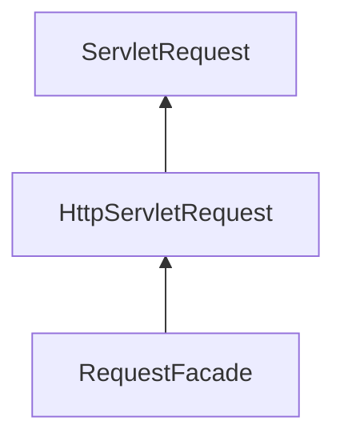
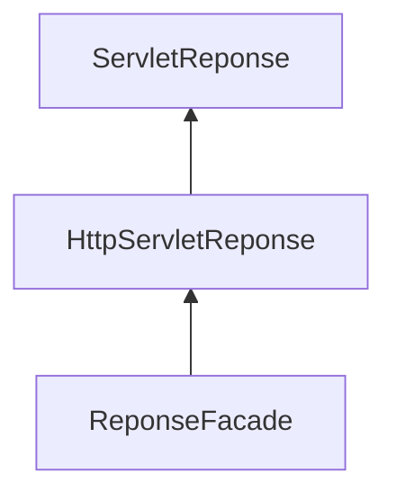

> Java Web 核心第二章。在 Java Servlet 中，Request 对象是用来封装请求数据的对象，Response 对象是用来封装响应数据的对象。Web 服务器收到客户端的 HTTP 请求，会针对每一次请求分别创建一个用于代表请求的 Request 对象和代表响应的 Response 对象。

<!--more-->

### 一、Request 和 Response 对象的使用

Request 和 Response 这两个参数的作用是什么?

Request：获取请求数据
* 浏览器会发送 HTTP 请求到后台服务器（Tomcat）。
* HTTP 的请求中会包含很多请求数据（请求行 + 请求头 + 请求体）。
* 后台服务器会对 HTTP 请求中的数据进行解析并把解析结果存入到一个对象中。
* 所存入的对象即为 Request 对象，所以我们可以从 Request 对象中获取请求的相关参数。
* 获取到数据后就可以继续后续的业务，比如获取用户名和密码就可以实现登录操作的相关业务。

Response：设置响应数据
* 业务处理完后，后台就需要给前端返回业务处理的结果，即响应数据。
* 把响应数据封装到 Response 对象中。
* 后台服务器（Tomcat）会解析 Response 对象，按照（响应行 + 响应头 + 响应体）格式拼接结果。
* 浏览器最终解析结果，把内容展示在浏览器给用户浏览。

初步体验下 Request 和 Response 对象的使用案例。

```java
@WebServlet("/demo3")
public class ServletDemo3 extends HttpServlet {
    @Override
    protected void doGet(HttpServletRequest request, HttpServletResponse response) throws ServletException, IOException {
        //使用request对象 获取请求数据
        String name = request.getParameter("name");//url?name=zhangsan

        //使用response对象 设置响应数据
        response.setHeader("content-type","text/html;charset=utf-8");
        response.getWriter().write("<h1>"+name+",欢迎您！</h1>");
    }

    @Override
    protected void doPost(HttpServletRequest request, HttpServletResponse response) throws ServletException, IOException {
        System.out.println("Post...");
    }
}
```

### 二、Request 对象

#### Request 继承体系

当我们的 Servlet 类实现的是 Servlet 接口的时候，service 方法中的参数是 ServletRequest 和 ServletResponse，当我们的 Servlet 类继承的是 HttpServlet 类的时候，doGet 和 doPost 方法中的参数就变成 HttpServletRequest 和 HttpServletReponse。

Request 的继承体系：



ServletRequest 和 HttpServletRequest 是继承关系，并且两个都是接口，接口是无法创建对象，需要用到 RequestFacade：该类实现了 HttpServletRequest 接口，也间接实现了ServletRequest接口。Servlet 类中的 service 方法、doGet 方法或者是 doPost 方法最终都是由 Web 服务器来调用的，所以 Tomcat 提供了方法参数接口的具体实现类，并完成了对象的创建。

要想了解 RequestFacade 中都提供了哪些方法，我们可以直接查看 JavaEE API 文档中关于 ServletRequest 和 HttpServletRequest 的接口文档，因为 RequestFacade 实现了其接口就需要重写接口中的方法。

```java
@WebServlet("/demo2")
public class ServletDemo2 extends HttpServlet {
    @Override
    protected void doGet(HttpServletRequest request, HttpServletResponse response) throws ServletException, IOException {
        System.out.println(request);
    }

    @Override
    protected void doPost(HttpServletRequest request, HttpServletResponse response) throws ServletException, IOException {
    }
}
```

#### Request 获取请求数据

获取请求行数据：请求行包含三块内容，分别是 `请求方式`、`请求资源路径`、`HTTP协议及版本`。

```java
@WebServlet("/req1")
public class RequestDemo1 extends HttpServlet {
    @Override
    protected void doGet(HttpServletRequest req, HttpServletResponse resp) throws ServletException, IOException {
        // String getMethod()：获取请求方式： GET
        String method = req.getMethod();
        System.out.println(method);//GET
        // String getContextPath()：获取虚拟目录(项目访问路径)：/request-demo
        String contextPath = req.getContextPath();
        System.out.println(contextPath);
        // StringBuffer getRequestURL(): 获取URL(统一资源定位符)：http://localhost:8080/request-demo/req1
        StringBuffer url = req.getRequestURL();
        System.out.println(url.toString());
        // String getRequestURI()：获取URI(统一资源标识符)： /request-demo/req1
        String uri = req.getRequestURI();
        System.out.println(uri);
        // String getQueryString()：获取请求参数（GET方式）： username=zhangsan
        String queryString = req.getQueryString();
        System.out.println(queryString);
    }
    @Override
    protected void doPost(HttpServletRequest req, HttpServletResponse resp) throws ServletException, IOException {
    }
}
```

获取请求头数据：请求头的数据格式为 `key: value`。

```java
@WebServlet("/req1")
public class RequestDemo1 extends HttpServlet {
    @Override
    protected void doGet(HttpServletRequest req, HttpServletResponse resp) throws ServletException, IOException {
        //获取请求头: user-agent: 浏览器的版本信息
        String agent = req.getHeader("user-agent");
		System.out.println(agent);
    }
    @Override
    protected void doPost(HttpServletRequest req, HttpServletResponse resp) throws ServletException, IOException {
    }
}
```

获取请求体数据：浏览器在发送 GET 请求的时候是没有请求体的，所以需要把请求方式变更为 POST。

1.   如果前端发送的是字节数据，比如传递的是文件数据，则使用 `getInputStream()` 方法获取字节输入流。

2.   如果前端发送的是纯文本数据，则使用 `getReader()` 方法获取字符输入流。

```java
@WebServlet("/req1")
public class RequestDemo1 extends HttpServlet {
    @Override
    protected void doGet(HttpServletRequest req, HttpServletResponse resp) throws ServletException, IOException {
    }
    @Override
    protected void doPost(HttpServletRequest req, HttpServletResponse resp) throws ServletException, IOException {
         //获取post 请求体：请求参数
        //1. 获取字符输入流
        BufferedReader br = req.getReader();
        //2. 读取数据
        String line = br.readLine();
        System.out.println(line);
    }
}
```

BufferedReader 流是通过 request 对象来获取的，当请求完成后 request 对象就会被销毁，request 对象被销毁后，BufferedReader 流就会自动关闭，所以此处就不需要手动关闭流了。

#### 获取请求参数的通用方式

请求参数是请求数据中的部分内容（如：用户名和密码），请求数据则是包含请求行、请求头和请求体的所有数据，如果是 GET 请求，请求参数在请求行中，如果是 POST 请求，请求参数一般在请求体中。

1.   GET 方式获取请求参数：`String getQueryString()`

2.   POST 方式获取请求参数：`BufferedReader getReader();`

```java
@WebServlet("/req1")
public class RequestDemo1 extends HttpServlet {
    @Override
    protected void doGet(HttpServletRequest req, HttpServletResponse resp) throws ServletException, IOException {
				//GET 方式获取请求参数
        String result = req.getQueryString();
        System.out.println(result);
    }
    @Override
    protected void doPost(HttpServletRequest req, HttpServletResponse resp) throws ServletException, IOException {
        // POST 方式获取请求参数
      	BufferedReader br = req.getReader();
        String result = br.readLine();
        System.out.println(result);
    }
}
```

GET 请求方式和 POST 请求方式区别主要在于获取请求参数的方式不一样，为了统一获取请求参数，Request 对象为我们提供了如下方法：

1.   获取所有参数Map集合：`Map<String,String[]> getParameterMap()`

2.   根据名称获取参数值（数组）：`String[] getParameterValues(String name)`

3.   根据名称获取参数值（单个值）：`String getParameter(String name)`

```java
/**
 * request 通用方式获取请求参数
 */
@WebServlet("/req2")
public class RequestDemo2 extends HttpServlet {
    @Override
    protected void doGet(HttpServletRequest req, HttpServletResponse resp) throws ServletException, IOException {
        //GET请求逻辑
        System.out.println("get....");
        //1. 获取所有参数的Map集合
        Map<String, String[]> map = req.getParameterMap();
        for (String key : map.keySet()) {
            // username:zhangsan lisi
            System.out.print(key+":");
            //获取值
            String[] values = map.get(key);
            for (String value : values) {
                System.out.print(value + " ");
            }
            System.out.println();
        }
        //2. 获取GET请求参数中的爱好，结果是数组值
        System.out.println("------------");
        String[] hobbies = req.getParameterValues("hobby");
        for (String hobby : hobbies) {
            System.out.println(hobby);
        }
      	//3. 获取GET请求参数中的用户名和密码，结果是单个值
        String username = req.getParameter("username");
        String password = req.getParameter("password");
        System.out.println(username);
        System.out.println(password);
    }

    @Override
    protected void doPost(HttpServletRequest req, HttpServletResponse resp) throws ServletException, IOException {
    }
}
```

`req.getParameter()` 方法使用的频率会比较高，以后我们再写代码的时候，就只需要按照如下格式来编写：

```java
public class RequestDemo1 extends HttpServlet {
    @Override
    protected void doGet(HttpServletRequest req, HttpServletResponse resp) throws ServletException, IOException {
       //采用request提供的获取请求参数的通用方式来获取请求参数
       //编写其他的业务代码...
    }
    @Override
    protected void doPost(HttpServletRequest req, HttpServletResponse resp) throws ServletException, IOException {
        this.doGet(req,resp);
    }
}
```

#### 请求参数中文乱码问题

POST 的请求参数是通过 request 的 `getReader()` 来获取流中的数据，Tomcat 在获取流的时候采用的编码是ISO-8859-1（不支持中文），需要通过 `request.setCharacterEncoding("UTF-8")` 把 Tomcat 在获取流数据之前的编码设置为UTF-8。

```java
@WebServlet("/req4")
public class RequestDemo4 extends HttpServlet {
    @Override
    protected void doGet(HttpServletRequest request, HttpServletResponse response) throws ServletException, IOException {
        //1. 解决乱码: POST getReader()
        //设置字符输入流的编码，设置的字符集要和页面保持一致
        request.setCharacterEncoding("UTF-8");
       //2. 获取username
       String username = request.getParameter("username");
       System.out.println(username);
    }

    @Override
    protected void doPost(HttpServletRequest request, HttpServletResponse response) throws ServletException, IOException {
        this.doGet(request, response);
    }
}
```

GET 请求获取请求参数的方式是 `request.getQueryString()`，并没有通过流的方式获取数据，所以 GET 请求不能用设置编码的方式来解决中文乱码问题。

GET 请求中文参数出现乱码的原因，是浏览器把中文参数按照  `UTF-8`  进行 URL 编码，而后台的 Tomcat 对获取到的内容进行 `ISO-8859-1` 的 URL 解码，我们可以按照 ISO-8859-1 编码获取乱码对应的字节数组，再按照 UTF-8 编码获取字节数组对应的字符串，在转换的过程中它们的编码一致，就可以解决中文乱码问题。

URL编码实现方式:

* 编码：`URLEncoder.encode(str,"UTF-8");`

* 解码：`URLDecoder.decode(s,"ISO-8859-1");`


```java
public class URLDemo {

  public static void main(String[] args) throws UnsupportedEncodingException {
        String username = "张三";
        //1. URL编码
        String encode = URLEncoder.encode(username, "utf-8");
        System.out.println(encode);
        //2. URL解码
        String decode = URLDecoder.decode(encode, "ISO-8859-1");

        System.out.println(decode); //此处打印的是对应的乱码数据

        //3. 转换为字节数据,编码
        byte[] bytes = decode.getBytes("ISO-8859-1");
        for (byte b : bytes) {
            System.out.print(b + " ");
        }
		//此处打印的是:-27 -68 -96 -28 -72 -119
        //4. 将字节数组转为字符串，解码
        String s = new String(bytes, "utf-8");
        System.out.println(s); //此处打印的是张三
    }
}
```

通用中文乱码解决方案：先解码，再编码。

```java
@WebServlet("/req4")
public class RequestDemo4 extends HttpServlet {
    @Override
    protected void doGet(HttpServletRequest request, HttpServletResponse response) throws ServletException, IOException {
        //1. 解决乱码：POST，getReader()
        //request.setCharacterEncoding("UTF-8");//设置字符输入流的编码

        //2. 获取username
        String username = request.getParameter("username");
        System.out.println("解决乱码前："+username);

        //3. GET,获取参数的方式：getQueryString
        // 乱码原因：tomcat进行URL解码，默认的字符集ISO-8859-1
       /* //3.1 先对乱码数据进行编码：转为字节数组
        byte[] bytes = username.getBytes(StandardCharsets.ISO_8859_1);
        //3.2 字节数组解码
        username = new String(bytes, StandardCharsets.UTF_8);*/

        username  = new String(username.getBytes(StandardCharsets.ISO_8859_1),StandardCharsets.UTF_8);

        System.out.println("解决乱码后："+username);

    }

    @Override
    protected void doPost(HttpServletRequest request, HttpServletResponse response) throws ServletException, IOException {
        this.doGet(request, response);
    }
}
```

把 `request.setCharacterEncoding("UTF-8")` 代码注释掉后，会发现 GET 请求参数乱码解决方案同时也可也把 POST 请求参数乱码的问题也解决了，只不过对于 POST 请求参数一般都会比较多，采用这种方式解决乱码起来比较麻烦，所以对于 POST 请求还是建议使用设置编码的方式进行。

Tomcat 8.0 之后的版本已将 GET 请求乱码问题解决，设置默认的解码方式为 UTF-8。

#### Request 请求转发

请求转发（forward）是一种在服务器内部的资源跳转方式。

请求转发的实现方式：`req.getRequestDispatcher("资源B路径").forward(req,resp);`。

```java
@WebServlet("/req5")
public class RequestDemo5 extends HttpServlet {
    @Override
    protected void doGet(HttpServletRequest request, HttpServletResponse response) throws ServletException, IOException {
        System.out.println("demo5...");
        //请求转发
        request.getRequestDispatcher("/req6").forward(request,response);
    }

    @Override
    protected void doPost(HttpServletRequest request, HttpServletResponse response) throws ServletException, IOException {
        this.doGet(request, response);
    }
}
```

请求转发资源间共享数据：使用 Request 对象。

1.   存储数据到 request 域中：`void setAttribute(String name,Object o);`

2.   根据 key 获取值：`Object getAttribute(String name);`

3.   根据 key 删除该键值对：`void removeAttribute(String name);`

```java
@WebServlet("/req5")
public class RequestDemo5 extends HttpServlet {
    @Override
    protected void doGet(HttpServletRequest request, HttpServletResponse response) throws ServletException, IOException {
        System.out.println("demo5...");
        //存储数据
        request.setAttribute("msg","hello");
        //请求转发
        request.getRequestDispatcher("/req6").forward(request,response);
    }
    @Override
    protected void doPost(HttpServletRequest request, HttpServletResponse response) throws ServletException, IOException {
        this.doGet(request, response);
    }
}

@WebServlet("/req6")
public class RequestDemo6 extends HttpServlet {
    @Override
    protected void doGet(HttpServletRequest request, HttpServletResponse response) throws ServletException, IOException {
        System.out.println("demo6...");
        //获取数据
        Object msg = request.getAttribute("msg");
        System.out.println(msg);
    }
    @Override
    protected void doPost(HttpServletRequest request, HttpServletResponse response) throws ServletException, IOException {
        this.doGet(request, response);
    }
}
```

请求转发的特点：浏览器地址栏路径不发生变化，只能转发到当前服务器的内部资源，而不能从一个服务器通过转发访问另一台服务器。一次请求可以在转发资源间使用 request 共享数据。

### 三、Response 对象

Reponse 的继承体系和 Request 的继承体系非常相似

Servlet -> `service(request, response)`



#### Response 设置响应数据

HTTP响应数据总共分为三部分内容，分别是响应行、响应头、响应体，对于这三部分内容的数据，respone 对象都提供了哪些方法来进行设置?

对于响应头，比较常用的就是设置响应状态码：`void setStatus(int sc);`。

设置响应头键值对：`void setHeader(String name,String value);`。

对于响应体，是通过字符、字节输出流的方式往浏览器写，获取字符输出流：`PrintWriter getWriter();`，或获取字节输出流：`ServletOutputStream getOutputStream();`。

介绍完这些方法后，后面我们会通过案例把这些方法都用一用，首先先来完成下重定向的功能开发。

#### Respones 请求重定向

Response 重定向（redirect）是一种资源跳转方式。浏览器发送请求给服务器，服务器中对应的资源 A 接收到请求。当资源 A 现在无法处理该请求，就会给浏览器响应一个 302 的状态码 + location 的一个访问资源 B 的路径。浏览器接收到响应状态码为 302 就会重新发送请求到 location 对应的访问地址去访问资源 B。资源 B 接收到请求后进行处理并最终给浏览器响应结果，这整个过程就叫重定向。

重定向的实现方式：

```http
resp.setStatus(302);
resp.setHeader("location","资源B的访问路径");
```

1.   具体使用，我们先创建 ResponseDemo1 类

```java
@WebServlet("/resp1")
public class ResponseDemo1 extends HttpServlet {
    @Override
    protected void doGet(HttpServletRequest request, HttpServletResponse response) throws ServletException, IOException {
        System.out.println("resp1....");
    }

    @Override
    protected void doPost(HttpServletRequest request, HttpServletResponse response) throws ServletException, IOException {
        this.doGet(request, response);
    }
}
```

2.   创建 ResponseDemo2 类

```java
@WebServlet("/resp2")
public class ResponseDemo2 extends HttpServlet {
    @Override
    protected void doGet(HttpServletRequest request, HttpServletResponse response) throws ServletException, IOException {
        System.out.println("resp2....");
    }

    @Override
    protected void doPost(HttpServletRequest request, HttpServletResponse response) throws ServletException, IOException {
        this.doGet(request, response);
    }
}
```

3.   在 ResponseDemo1 的 doGet 方法中给前端响应数据

```java
@WebServlet("/resp1")
public class ResponseDemo1 extends HttpServlet {
    @Override
    protected void doGet(HttpServletRequest request, HttpServletResponse response) throws ServletException, IOException {
        System.out.println("resp1....");
        //重定向
        //1.设置响应状态码 302
        response.setStatus(302);
        //2. 设置响应头 Location
        response.setHeader("Location","/request-demo/resp2");
    }

    @Override
    protected void doPost(HttpServletRequest request, HttpServletResponse response) throws ServletException, IOException {
        this.doGet(request, response);
    }
}
```

4.   虽然功能已经实现，但是从设置重定向的两行代码来看，会发现除了重定向的地址不一样，其他的内容都是一模一样，所以request对象给我们提供了简化的编写方式为：`resposne.sendRedirect("/request-demo/resp2")`。

```java
@WebServlet("/resp1")
public class ResponseDemo1 extends HttpServlet {
    @Override
    protected void doGet(HttpServletRequest request, HttpServletResponse response) throws ServletException, IOException {
        System.out.println("resp1....");
        //重定向
        resposne.sendRedirect("/request-demo/resp2")；
    }
    @Override
    protected void doPost(HttpServletRequest request, HttpServletResponse response) throws ServletException, IOException {
        this.doGet(request, response);
    }
}
```

重定向的特点

* 浏览器地址栏路径发送变化：当进行重定向访问的时候，由于是由浏览器发送的两次请求，所以地址会发生变化。

* 可以重定向到任何位置的资源(服务内容、外部均可)，因为第一次响应结果中包含了浏览器下次要跳转的路径，所以这个路径是可以任意位置资源。

* 两次请求，不能在多个资源使用 request 共享数据，因为浏览器发送了两次请求，是两个不同的 request 对象，就无法通过 request 对象进行共享数据


#### 路径问题

1. 转发的时候路径上没有加 `/request-demo` 而重定向加了，因为对于转发来说，因为是在服务端进行的，所以不需要加虚拟目录。对于重定向来说，路径最终是由浏览器来发送请求，就需要添加虚拟目录。

2. 在重定向的代码中，`/request-demo` 是固定编码的，如果后期通过 Tomcat 插件配置了项目的访问路径，那么所有需要重定向的地方都需要重新修改，因此我们可以在代码中动态去获取项目访问的虚拟目录进行优化，具体可以借助 request 对象 `getContextPath() `方法，修改后的代码如下：

```java
@WebServlet("/resp1")
public class ResponseDemo1 extends HttpServlet {
    @Override
    protected void doGet(HttpServletRequest request, HttpServletResponse response) throws ServletException, IOException {
        System.out.println("resp1....");

        //简化方式完成重定向
        //动态获取虚拟目录
        String contextPath = request.getContextPath();
        response.sendRedirect(contextPath+"/resp2");
    }

    @Override
    protected void doPost(HttpServletRequest request, HttpServletResponse response) throws ServletException, IOException {
        this.doGet(request, response);
    }
}
```

重新启动访问测试，功能依然能够实现，此时就可以动态获取项目访问的虚拟路径，从而降低代码的耦合度。

#### Response 响应字符数据

要想将字符数据写回到浏览器，我们需要两个步骤：首先通过 Response 对象获取字符输出流（`PrintWriter writer = resp.getWriter();`），再通过字符输出流写数据（`writer.write("aaa");`）

1. 返回一个简单的字符串 `aaa`。

```java
/**
 * 响应字符数据：设置字符数据的响应体
 */
@WebServlet("/resp3")
public class ResponseDemo3 extends HttpServlet {
    @Override
    protected void doGet(HttpServletRequest request, HttpServletResponse response) throws ServletException, IOException {
        response.setContentType("text/html;charset=utf-8");
        //1. 获取字符输出流
        PrintWriter writer = response.getWriter();
		 writer.write("aaa");
    }
    @Override
    protected void doPost(HttpServletRequest request, HttpServletResponse response) throws ServletException, IOException {
        this.doGet(request, response);
    }
}
```

2. 返回一串 html 字符串，并且能被浏览器解析。

```java
PrintWriter writer = response.getWriter();
//content-type，告诉浏览器返回的数据类型是HTML类型数据，这样浏览器才会解析HTML标签
response.setHeader("content-type","text/html");
writer.write("<h1>aaa</h1>");
//一次请求响应结束后，response 对象就会被销毁掉，所以不要手动关闭流。
```

3. 返回一个中文的字符串 `你好`，需要注意设置响应数据的编码为 `utf-8`

```java
//设置响应的数据格式及数据的编码
response.setContentType("text/html;charset=utf-8");
writer.write("你好");
```

#### Response 响应字节数据

要想将字节数据写回到浏览器，我们需要两个步骤：首先通过Response对象获取字节输出流（`ServletOutputStream outputStream = resp.getOutputStream();`），再通过字节输出流写数据（`outputStream.write(字节数据);`）。

响应字符数据的实际应用：

1. 返回一个图片文件到浏览器

```java
/**
 * 响应字节数据：设置字节数据的响应体
 */
@WebServlet("/resp4")
public class ResponseDemo4 extends HttpServlet {
    @Override
    protected void doGet(HttpServletRequest request, HttpServletResponse response) throws ServletException, IOException {
        //1. 读取文件
        FileInputStream fis = new FileInputStream("d://a.jpg");
        //2. 获取response字节输出流
        ServletOutputStream os = response.getOutputStream();
        //3. 完成流的copy
        byte[] buff = new byte[1024];
        int len = 0;
        while ((len = fis.read(buff))!= -1){
            os.write(buff,0,len);
        }
        fis.close();
    }

    @Override
    protected void doPost(HttpServletRequest request, HttpServletResponse response) throws ServletException, IOException {
        this.doGet(request, response);
    }
}
```

上述代码中，对于流的 copy 的代码还是比较复杂的，所以我们可以使用别人提供好的方法来简化代码的开发，具体的步骤是：

1.   pom.xml 添加依赖

```xml
<dependency>
    <groupId>commons-io</groupId>
    <artifactId>commons-io</artifactId>
    <version>2.6</version>
</dependency>
```

2.   调用工具类方法

```java
//fis:输入流
//os:输出流
IOUtils.copy(fis,os);
```

优化后的代码：

```java
/**
 * 响应字节数据：设置字节数据的响应体
 */
@WebServlet("/resp4")
public class ResponseDemo4 extends HttpServlet {
    @Override
    protected void doGet(HttpServletRequest request, HttpServletResponse response) throws ServletException, IOException {
        //1. 读取文件
        FileInputStream fis = new FileInputStream("d://a.jpg");
        //2. 获取response字节输出流
        ServletOutputStream os = response.getOutputStream();
        //3. 完成流的copy
      	IOUtils.copy(fis,os);
        fis.close();
    }

    @Override
    protected void doPost(HttpServletRequest request, HttpServletResponse response) throws ServletException, IOException {
        this.doGet(request, response);
    }
}
```

